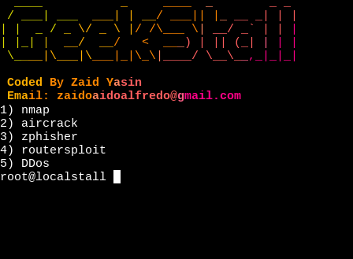

Installs Hacking tools KALI:

[+] sudo apt install git

[+] git clone https://github.com/chill-c0der/geekstall.git

[+] cd geekstall

[+] sudo bash geekstall.sh

TERMUX:

[+] apt update

[+] apt upgrade

[+] bash termux.sh

If it does not display anything or no menu after installing something just press Enter 

